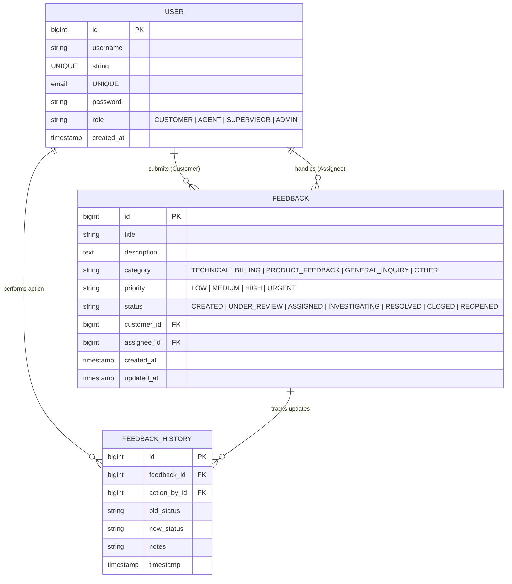
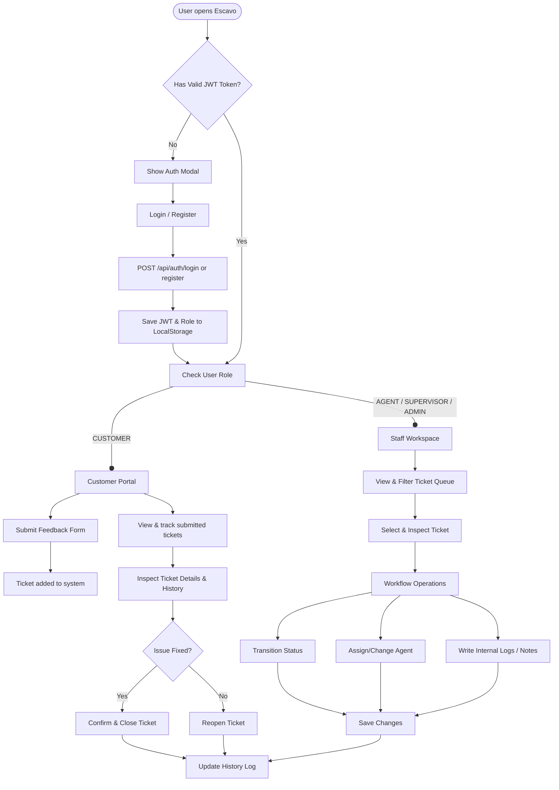

Hi Viewer 👋,

Welcome to **Escavo** — a premium, dynamic Feedback & Escalation Portal designed to connect customers and support staff seamlessly. Below you will find all the details regarding the application's architecture, database schema, tech stack, and system workflows.

---

## 1. Description

**Escavo** is a modern, responsive web application built to streamline the lifecycle of feedback submission and escalation management. 

- **Customer Portal**: Allows users to sign up, submit feedback with custom categories and severity levels, and track the status of their requests.
- **Staff Workspace**: Empowers support agents and supervisors to view active queues, assign agents, transition ticket statuses, and log audit trails.
- **Security**: Features secure, token-based authentication (JWT) for authentication and access control based on user roles (`CUSTOMER`, `AGENT`, `SUPERVISOR`, `ADMIN`).

---

## 2. ER Diagram

The backend database persists authentication data and tracks entities using PostgreSQL. Below is the Entity-Relationship (ER) model:



---

## 3. Techstacks

Escavo leverages a modern, robust, and performant tech stack across both frontend and backend layers:

| Layer | Technology | Purpose |
| :--- | :--- | :--- |
| **Backend Framework** | Spring Boot 3.3.2 | Core application, REST API services, and dependency injection |
| **Security & Auth** | Spring Security & JWT | Stateless authentication, route protection, and RBAC |
| **Database ORM** | Spring Data JPA (Hibernate) | Data access layer and schema management |
| **Database** | PostgreSQL (Supabase) | Reliable, relational database persistence |
| **Frontend UI** | HTML5, Vanilla CSS, JS | High-performance, premium UI featuring glassmorphism |
| **Build Tool** | Apache Maven | Project build and dependency management |

---

## 4. How the System Works (Navigatable Diagram Flow)

Here is how users navigate and interact with Escavo:



---

## 5. How to Work On & Use This Application

### 🚀 1. Running the Server Locally
1. Ensure Java 17+ / Java 21 and Maven are installed.
2. Open a terminal in the root project directory (`CapstoneProject`).
3. Run the Spring Boot backend server:
   ```bash
   mvn spring-boot:run
   ```
4. Access the web application in your browser at:
   👉 **[http://localhost:3000](http://localhost:3000)**

---

### 👤 2. User Roles & Authentication
When you open [http://localhost:3000](http://localhost:3000):
- **Sign Up / Register**: Click **Register** on the modal to create an account with one of the available roles:
  - `CUSTOMER`: Submit feedback and track your own requests.
  - `AGENT`: View assigned support tickets, update status, and log resolution notes.
  - `SUPERVISOR`: Monitor all tickets across team queues, reassign agents, and manage escalations.
  - `ADMIN`: Full administrative control over tickets and system workflows.
- **Login**: Enter your credentials to receive a JWT authentication token, which automatically routes you to your specific role interface.

---

### 📥 3. How to Use as a Customer (`CUSTOMER` Role)
1. **Submit Feedback**:
   - Fill out the **New Feedback** form with a Title, Category (e.g., *TECHNICAL*, *BILLING*, *PRODUCT_FEEDBACK*), Priority level (*LOW*, *MEDIUM*, *HIGH*, *URGENT*), and Detailed Description.
   - Click **Submit Feedback**.
2. **Track Tickets**:
   - View all your submitted tickets in **My Submitted Tickets**.
   - Click on any ticket to view its full audit history, status changes, and assigned support staff.
3. **Close or Reopen Tickets**:
   - If your issue is resolved, click **Confirm & Close**.
   - If you need further assistance, click **Reopen Ticket**.

---

### 🛠️ 4. How to Use as Support Staff / Admin (`AGENT`, `SUPERVISOR`, `ADMIN`)
1. **View Ticket Queue**:
   - Access the **Staff Workspace** queue to filter tickets by status or priority.
2. **Inspect Ticket Details**:
   - Click on a ticket from the queue to view customer details and complete audit trail.
3. **Take Action & Update Ticket**:
   - **Assign Agent**: Select an agent to take ownership of the ticket.
   - **Update Status**: Transition ticket status (*UNDER_REVIEW*, *INVESTIGATING*, *RESOLVED*, *CLOSED*).
   - **Log Notes**: Add internal audit notes for every workflow change.

---

### 🧪 5. Development & Testing
- **Run Unit Tests**:
  ```bash
  mvn test
  ```
- **Frontend Source**: Modify HTML structure in [index.html](file:///c:/Users/rthar/OneDrive/Desktop/CapstoneProject/src/main/resources/static/index.html), styling in [styles.css](file:///c:/Users/rthar/OneDrive/Desktop/CapstoneProject/src/main/resources/static/styles.css), and dynamic logic in [app.js](file:///c:/Users/rthar/OneDrive/Desktop/CapstoneProject/src/main/resources/static/app.js).

---

## 6. End

Thank you for exploring the **Escavo** codebase! If you have any questions or ideas for improvements, feel free to open a ticket or reach out to the development team. 

Happy resolving! 🚀

